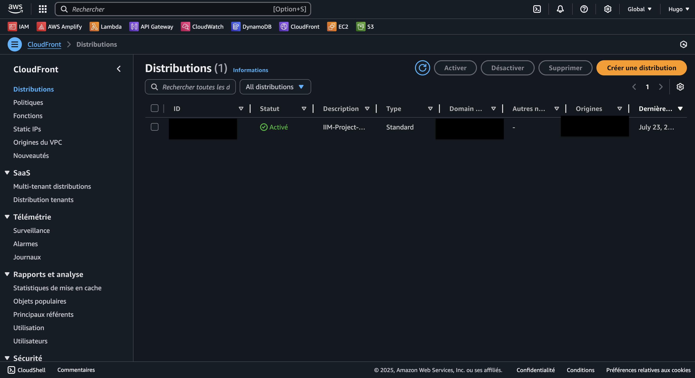
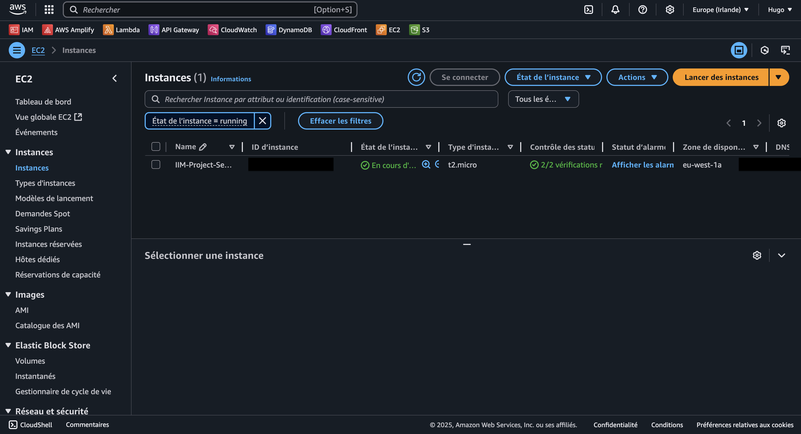
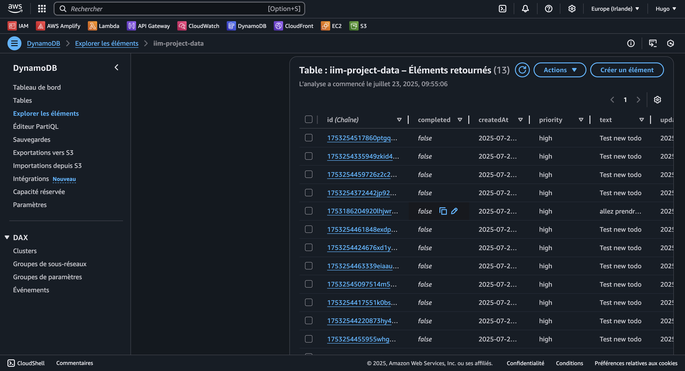
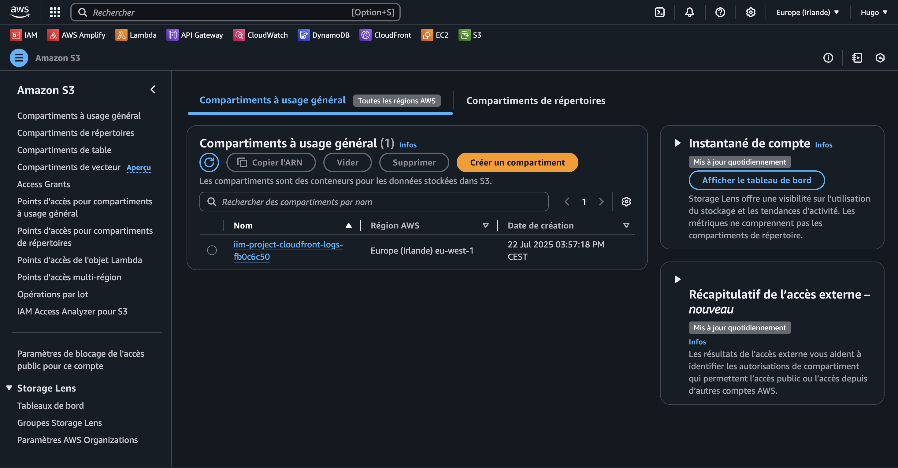
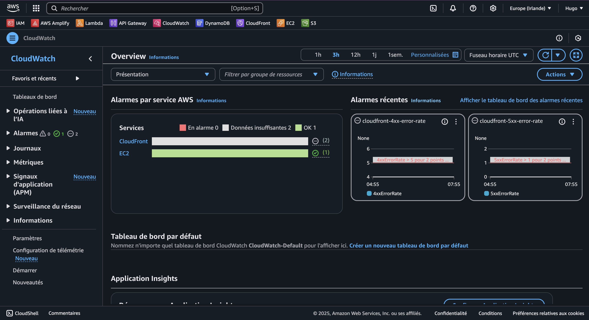
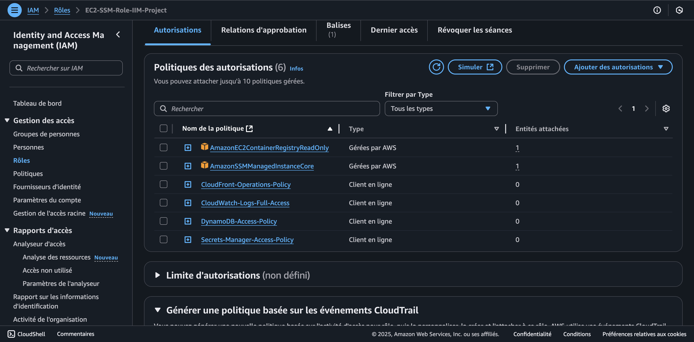
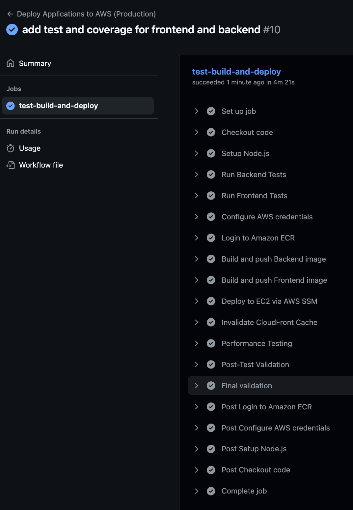
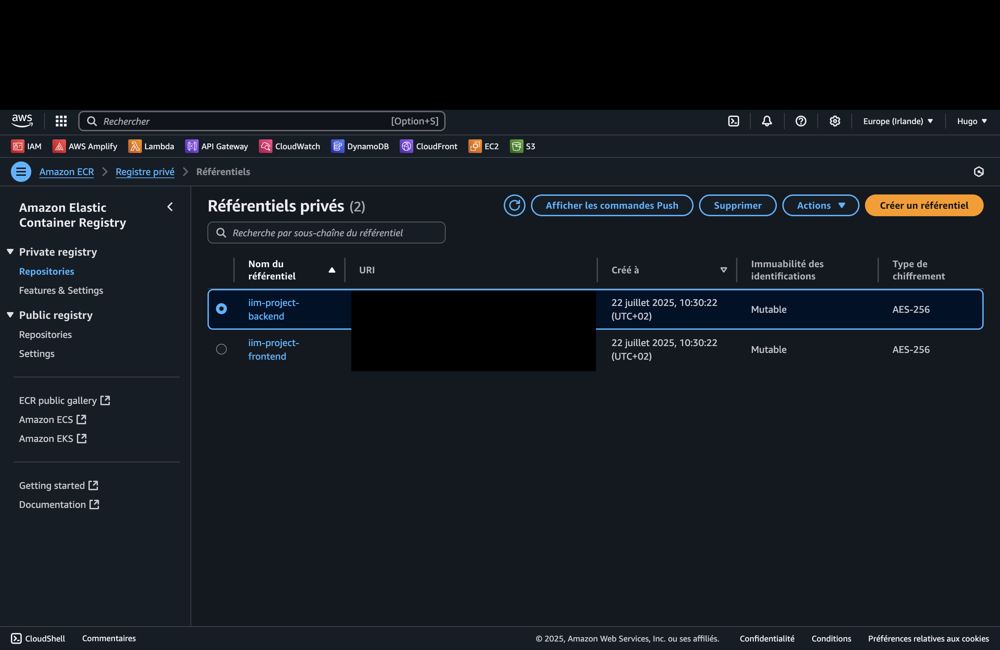
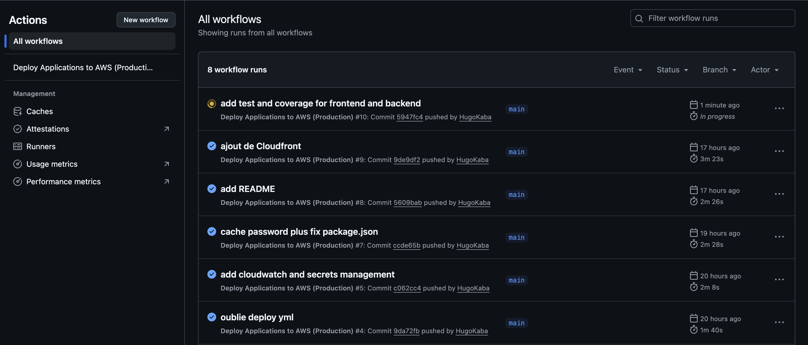

# 🚀 Projet Cloud DevOps IIM - Guide Complet

Un projet de déploiement d'applications web containerisées sur AWS avec Terraform et GitHub Actions dans le cadre d'un projet d'etude.


## 📋 Table des matières

- [Vue d'ensemble](#-vue-densemble)
- [Architecture](#-architecture)
- [Prérequis](#-prérequis)
- [Installation et configuration](#-installation-et-configuration)
- [Déploiement local](#-déploiement-local)
- [Déploiement sur AWS](#-déploiement-sur-aws)
- [Commandes utiles](#-commandes-utiles)
- [Surveillance et monitoring](#-surveillance-et-monitoring)
- [Note sur l'utilisation de l'IA](#-note-sur-lutilisation-de-lia)
- [Architecture détaillée](#-architecture-détaillée)
- [Dépannage](#-dépannage)

## 🎯 Vue d'ensemble

Ce projet implémente une architecture Cloud DevOps complète avec :

- **Frontend React** : Interface utilisateur moderne avec gestion des tâches (Todo List)
- **Backend Node.js** : API REST avec connexion DynamoDB
- **Infrastructure as Code** : Terraform pour l'infrastructure AWS
- **Pipeline CI/CD** : GitHub Actions pour le déploiement automatisé
- **CDN Global** : CloudFront pour performance mondiale
- **Sécurité avancée** : AWS IAM Roles + Session Manager
- **Monitoring** : CloudWatch avec dashboard et alertes
- **Terraform Backend** : S3 + DynamoDB pour l'état Terraform
- **Tests automatisés** : Suite de tests pour le backend et le frontend

### 🏆 Innovations techniques

- **Déploiement** : Utilisation d'AWS Systems Manager Session Manager
- **Architecture IAM avancée** : Rôles spécifiques pour chaque service
- **CDN CloudFront** : Distribution globale avec cache intelligent
- **Pipeline sécurisé** : Secrets management avec AWS Secrets Manager
- **Monitoring complet** : CloudWatch Logs + Dashboard + Métriques personnalisées

## 🏗️ Architecture

```
       ┌─────────────────┐    ┌─────────────────┐    ┌─────────────────┐
       │   GitHub Repo   │───▶│ GitHub Actions  │───▶│   AWS Cloud     │
       │                 │    │    (CI/CD)      │    │                 │
       └─────────────────┘    └─────────────────┘    └─────────────────┘
                                         │
       ┌─────────────────────────────────┼──────────────────────────┐
       │                                 │                          │
┌──────▼──────┐                   ┌──────▼──────┐            ┌──────▼──────┐
│ CloudFront  │                   │     EC2     │            │   DynamoDB  │
│    (CDN)    │◄──────────────────┤    (Apps)   │            │ (Database)  │
└─────────────┘                   └─────────────┘            └─────────────┘
       │                                 │
┌──────▼──────┐                   ┌──────▼──────┐
│      S3     │                   │ CloudWatch  │
│  (Logs CF)  │                   │(Monitoring) │
└─────────────┘                   └─────────────┘
```






## 📋 Prérequis

### Comptes et accès requis

- **Compte AWS** avec Free Tier activé
- **Compte GitHub** pour le repository et les Actions
- **AWS CLI** configuré avec vos identifiants
- **Terraform** installé (version >= 1.0)
- **Docker** installé et fonctionnel
- **Node.js** (version >= 18) pour le développement local
  
## 🚀 Déploiement automatisé

### Processus one-click pour fork du projet

Si quelqu'un souhaite déployer votre projet, voici le processus simplifié :

#### 1. Fork et clone
```
git clone <votre-fork>
cd projet-cloud-devops
```

#### 2. Configurer AWS CLI
```
aws configure
# Entrez vos identifiants AWS
# Default region name: eu-west-1
# Default output format: json
```

#### 3. Setup du backend Terraform (une seule fois)
```
chmod +x setup_backend.sh
./setup_backend.sh
```
Le script configure automatiquement :
- Bucket S3 pour l'état Terraform (avec chiffrement)
- Table DynamoDB pour le verrouillage
- Fichier `prod.s3.tfbackend` avec les bonnes valeurs
- Initialisation du backend Terraform

#### 4. Configuration des secrets GitHub

Dans **Settings → Secrets and variables → Actions** :

| Nom du secret           | Valeur                        | Description            |
| ----------------------- | ----------------------------- | ---------------------- |
| `AWS_ACCESS_KEY_ID`     | Votre clé d'accès AWS         | Authentification AWS   |
| `AWS_SECRET_ACCESS_KEY` | Votre clé secrète AWS         | Authentification AWS   |
| `AWS_ACCOUNT_ID`        | ID de votre compte AWS        | Accès ECR              |
| `EC2_HOST`              | IP publique de votre instance | Adresse de déploiement |
| `BACKEND_HOST`          | IP publique de votre instance | Configuration frontend |
| `BACKEND_PORT`          | `3001`                        | Port du backend        |
| `TF_DYNAMODB_TABLE`     | `terraform-lock-prod`         | Table DynamoDB pour verrouillage Terraform |
| `TF_STATE_BUCKET`       | `terraform-state-(le timestamp renvoyer par le script)`        | Bucket S3 pour l'état Terraform |

#### 5. Déploiement automatique

git add .
git commit -m "Ready to deploy"
git push

**C'est tout !** Le pipeline GitHub Actions déploie automatiquement :
- Infrastructure Terraform (EC2, CloudFront, DynamoDB, etc.)
- Images Docker vers ECR
- Applications sur EC2 via Session Manager
- Configuration réseau et sécurité

### 2. Structure du projet

```

projet-cloud-devops/
├── .github/workflows/      \# Pipeline CI/CD
│   └── deploy.yml
├── backend/               \# API Node.js
│   ├── Dockerfile
│   ├── package.json
│   └── server.js
├── frontend/              \# Application React
│   ├── Dockerfile
│   ├── package.json
│   ├── public/
│   └── src/
├── terraform/             \# Infrastructure as Code
│   ├── main.tf
│   ├── prod.s3.tfbackend  \# Backend S3 pour l'état Terraform
│   ├── backend.tf
│   ├── variables.tf
│   ├── outputs.tf
│   ├── iam.tf
│   ├── cloudwatch.tf
│   ├── secrets.tf
│   ├── dynamodb.tf
│   └── ecr.tf
├── docker-compose.yml     \# Développement local
├── .gitignore
├── setup_terraform_backend.sh \# Script de setup backend Terraform
└── README.md

```
## 📊 Surveillance et monitoring

### 1. CloudWatch Dashboard

```


# URL du dashboard (remplacer ACCOUNT_ID et REGION)

https://console.aws.amazon.com/cloudwatch/home?region=eu-west-1\#dashboards:name=IIM-Project-Dashboard

```



### 2. Logs des applications

```


# Voir les logs via AWS CLI

aws logs describe-log-groups --region eu-west-1
aws logs tail /iim-project/application --follow --region eu-west-1

# Logs directement sur l'instance

aws ssm start-session --target INSTANCE_ID
docker logs frontend-app
docker logs backend-app

```

### 3. Métriques personnalisées

- **Backend metrics** : http://VOTRE_IP/api/metrics
- **CloudWatch metrics** : CPU, Network, Memory
- **Application metrics** : Uptime, Request count, Errors

## 🤖 Note sur l'utilisation de l'IA

Dans ce projet, j'ai utilisé l'intelligence artificielle de manière ciblée pour améliorer deux aspects spécifiques **après avoir terminé l'application fonctionnelle** :

### 🎨 Amélioration du style frontend

Une fois l'application React entièrement développée et fonctionnelle, j'ai utilisé l'IA pour :

- **Optimiser le CSS** : Amélioration de l'interface utilisateur avec des animations et transitions
- **Responsive design** : Adaptation mobile-first pour une meilleure expérience utilisateur
- **Couleurs et thèmes** : Harmonisation de la palette de couleurs et amélioration de l'accessibilité

### 📋 Amélioration des logs CI/CD

Pour rendre le pipeline plus professionnel et plus lisible, l'IA m'a aidé à :

- **Formater les logs** : Ajout d'emojis et de couleurs pour une meilleure lisibilité
- **Messages informatifs** : Amélioration des messages de status et de progression
- **Gestion d'erreurs** : Messages d'erreur plus explicites et solutions suggérées

### 💡 Approche méthodologique

Il est important de noter que :

- **L'architecture complète** a été conçue et développée manuellement
- **Toute la logique métier** (API, base de données, infrastructure) a été écrite sans assistance
- **L'IA n'a été utilisée qu'en finition** pour l'amélioration esthétique ,expérience utilisateur et optimiser le code, afin de rendre le projet public et bien structurer

## 🏗️ Architecture détaillée

### Composants AWS

#### Infrastructure Core
- **EC2** : Instance t2.micro avec Amazon Linux 2
  - Configuration optimisée pour Docker et Node.js
  - IAM Instance Profile pour accès sécurisé aux services AWS
  - Session Manager activé (aucun accès SSH requis)
  - Elastic IP pour adresse IP fixe

- **VPC et Networking** : 
  - Utilisation du VPC par défaut avec Security Groups configurés
  - Ports ouverts : 80 (HTTP), 3000-3001 (applications)
  - Règles de sécurité restrictives avec accès contrôlé

#### Stockage et Base de données
- **DynamoDB** : Base de données NoSQL pour les données d'application
  - Table : `iim-project-data` avec clé primaire `id`
  - Mode de facturation : Pay-per-request (optimisé pour développement)
  - Chiffrement au repos activé par défaut

- **S3** : Stockage multi-usage
  - Bucket pour les logs CloudFront avec chiffrement AES256
  - Bucket pour l'état Terraform (backend centralisé)
  - Versioning activé et accès public bloqué

#### Container Registry et CDN
- **ECR** : Registre Docker privé pour les images
  - Repositories : `iim-project-frontend` et `iim-project-backend`
  - Scan de sécurité automatique activé
  - Lifecycle policies pour optimiser les coûts

- **CloudFront** : CDN global avec 100+ edge locations
  - Distribution optimisée pour applications React/Node.js
  - Cache behaviors spécifiques : statiques (1 an), API (pas de cache)
  - Compression gzip automatique et HTTP/2 activé
  - Restriction géographique configurée (whitelist)

#### Sécurité et Monitoring
- **IAM** : Rôles et politiques pour la sécurité
  - Rôle EC2 avec permissions granulaires (DynamoDB, ECR, CloudWatch, Secrets Manager)
  - Politiques spécifiques pour chaque service sans over-permissions
  - Rotation automatique des credentials via Instance Profile

- **Secrets Manager** : Gestion sécurisée des secrets
  - Secret : `iim-project-secrets` avec rotation automatique
  - Chiffrement avec clés AWS KMS
  - Accès contrôlé via IAM policies

- **CloudWatch** : Monitoring et logs centralisés
  - Log Groups : `/iim-project/application` et `/aws/ec2/containers`
  - Dashboard personnalisé avec métriques applicatives
  - Alertes automatiques (CPU > 80%, erreurs 4xx/5xx CloudFront)
  - Rétention des logs : 7 jours (optimisé coût/debug)

- **Systems Manager** : Accès sécurisé aux instances sans SSH
  - Session Manager pour connexion chiffrée
  - Patch Manager pour mises à jour automatiques
  - Parameter Store pour configuration (si nécessaire)
  
### Sécurité

#### Accès et Authentification
- **Aucune clé SSH** : Utilisation exclusive de Session Manager
  - Connexions chiffrées via AWS Systems Manager
  - Logs d'accès centralisés dans CloudTrail
  - Révocation d'accès instantanée via IAM

- **IAM Roles** : Permissions granulaires par service
  - Principe du moindre privilège appliqué
  - Rôles spécifiques : EC2, CloudFront, Lambda (si utilisé)
  - Pas de credentials hardcodés dans le code

#### Chiffrement et Protection des données
- **Chiffrement en transit** : 
  - HTTPS ready avec CloudFront (certificat SSL/TLS automatique)
  - Connexions chiffrées entre services AWS
  - Session Manager utilise TLS 1.2+

- **Chiffrement au repos** :
  - DynamoDB : Chiffrement par défaut avec clés AWS KMS
  - S3 : Chiffrement AES256 pour tous les buckets
  - Secrets Manager : Chiffrement avec rotation automatique

#### Isolation et Contrôle d'accès
- **Secrets masqués** : Aucun secret visible dans les logs
  - Variables d'environnement sécurisées via Secrets Manager
  - GitHub Secrets pour les credentials AWS (jamais en plaintext)
  - Logs applicatifs sans exposition de données sensibles

- **Network Security** :
  - Security Groups restrictifs (ports minimums ouverts)
  - Pas d'accès direct à DynamoDB depuis l'extérieur
  - CloudFront comme seul point d'entrée HTTPS public

#### Monitoring de sécurité
- **CloudTrail** : Audit trail de toutes les actions AWS
- **CloudWatch Alarms** : Alertes sur comportements anormaux
- **ECR Image Scanning** : Scan automatique des vulnérabilités
- **WAF Ready** : Architecture préparée pour AWS WAF si nécessaire




### Pipeline CI/CD

Le pipeline GitHub Actions s'exécute automatiquement selon cette séquence :

1. **Infrastructure Terraform** : Déploiement/mise à jour de l'infrastructure AWS
   - Initialisation du backend S3 avec `prod.s3.tfbackend`
   - Validation du formatage avec `terraform fmt -check`
   - Planification et application des changements d'infrastructure

2. **Tests automatisés** : Validation du code backend et frontend
   - Tests unitaires backend : 8 tests couvrant tous les endpoints API
   - Tests frontend React avec mocks axios
   - **Blocage du déploiement** si un test échoue

3. **Construction des images Docker** : (seulement si tests passent)
   - Build de l'image backend Node.js avec optimisations
   - Build de l'image frontend React avec optimisations de production
   - Tagging avec `latest` et hash du commit GitHub

4. **Push vers ECR** : Envoi des images vers Amazon Elastic Container Registry
   - Authentification automatique via GitHub Actions
   - Push simultané des versions `latest` et `commit-hash`
   - Scan de sécurité automatique des images

5. **Déploiement via SSM sur EC2** : 
   - Connexion sécurisée via AWS Systems Manager Session Manager
   - Pull des nouvelles images depuis ECR
   - Déploiement zero-downtime avec réseau Docker isolé
   - Configuration des variables d'environnement production

6. **Invalidation CloudFront** : Mise à jour du cache CDN global
   - Invalidation automatique de tous les chemins (`/*`)
   - Attente de la propagation sur les 100+ edge locations
   - Validation de la mise à jour du cache

7. **Health checks et validation** : Validation automatique post-déploiement
   - Test de l'endpoint `/api/health` du backend
   - Vérification de l'accessibilité du frontend
   - Tests de performance entre accès direct et CloudFront
   - Rapport automatique dans les logs GitHub Actions

8. **Notification** : Status complet dans GitHub Actions avec métriques





## 🧪 Tests automatisés

### Suite de tests complète

Le projet inclut une suite de tests automatisés qui s'exécutent à chaque push vers la branche main :

- **Tests Backend** : 8 tests unitaires et d'intégration couvrant tous les endpoints API
- **Tests Frontend** : Tests de composants React avec mocks axios
- **Pipeline de validation** : Les tests bloquent le déploiement en cas d'échec

### Types de tests implémentés

#### Tests Backend (Node.js)

- **Tests d'API REST** : Validation de tous les endpoints (`/api/health`, `/api/todos`, `/api/metrics`)
- **Tests de gestion d'erreurs** : Validation des codes d'erreur 400, 404, 500
- **Mocks DynamoDB** : Tests isolés avec aws-sdk-mock
- **Tests de validation** : Vérification des schémas de données

#### Tests Frontend (React)

- **Tests de composants** : Rendu des éléments principaux
- **Tests d'interaction** : Formulaires et boutons
- **Tests d'intégration** : Communication avec l'API backend
- **Tests d'erreurs** : Gestion gracieuse des erreurs réseau

### Couverture de code

- **Backend** : Couverture complète des routes API et gestion d'erreurs
- **Frontend** : Tests des composants principaux et interactions utilisateur
- **Rapports** : Génération automatique de rapports de couverture


## 🎓 Conclusion

Ce projet est une stack Cloud DevOps moderne avec :

- Infrastructure as Code avec Terraform
- Containerisation avec Docker
- Pipeline CI/CD automatisé avec GitHub Actions
- Architecture sécurisée sans SSH
- Monitoring et observabilité avec CloudWatch

**Auteur** : Hugo Kaba  
**Projet** : IIM A4 Cloud DevOps  
**Technologies** : AWS, Terraform, Docker, React, Node.js, GitHub Actions  
**Date** : Juillet 2025